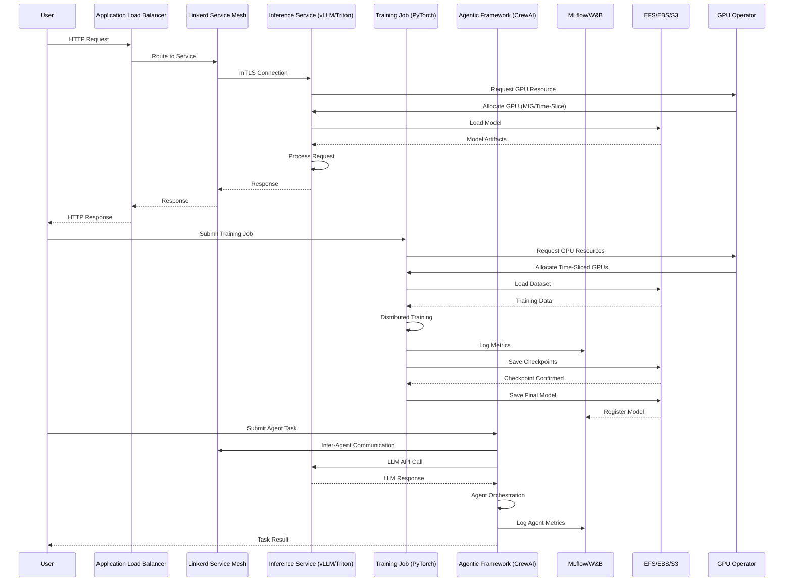
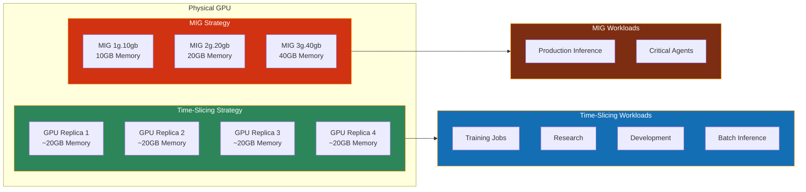
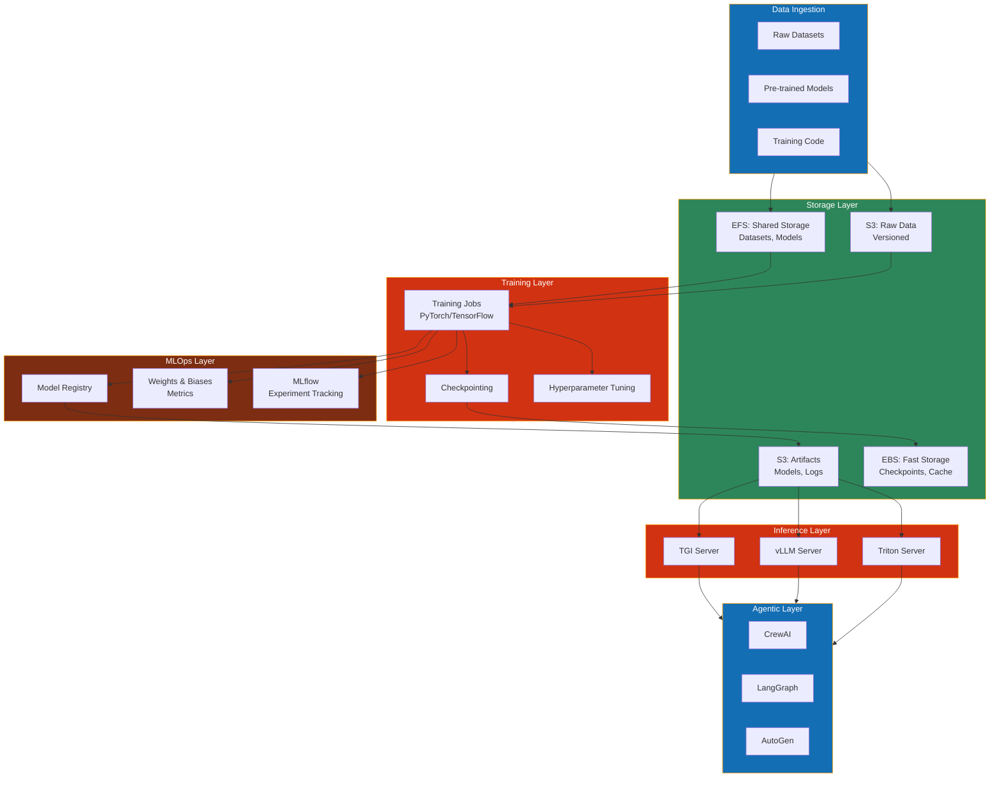
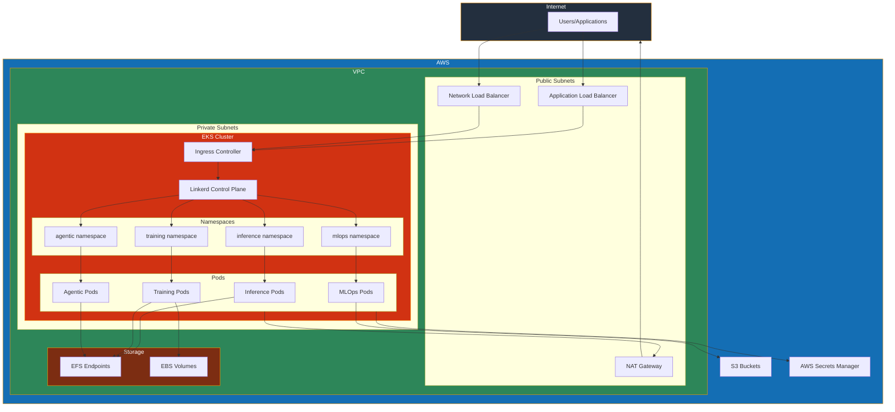
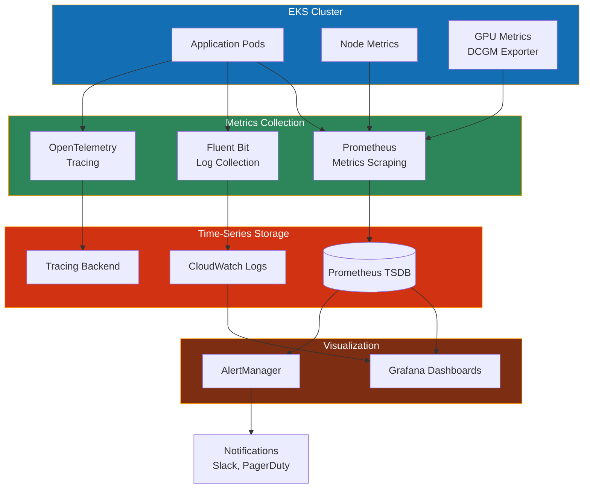

# System Architecture Diagram

This document contains the comprehensive system architecture diagram for the AI/MLOps platform.

## High-Level System Architecture

```mermaid
graph TB
    subgraph AWS["AWS Cloud"]
        subgraph VPC["VPC"]
            subgraph EKS["EKS Cluster"]
                subgraph CP["Control Plane"]
                    API[Kubernetes API Server]
                    ETCD[etcd]
                    SCHED[Scheduler]
                end
                
                subgraph CPU_POOL["CPU Node Pool<br/>m5.2xlarge/m5.4xlarge"]
                    direction TB
                    MLOPS[MLOps Tools<br/>MLflow, W&B]
                    AGENTS[Agentic Frameworks<br/>CrewAI, LangGraph, AutoGen]
                    MONITOR[Monitoring Stack<br/>Prometheus, Grafana]
                    MESH[Linkerd Control Plane]
                end
                
                subgraph A100_TS["A100 Node Pool - Time-Slicing<br/>p5.48xlarge (8x A100 80GB)"]
                    direction TB
                    A100_TS_TRAIN[Training Jobs<br/>PyTorch, TensorFlow]
                    A100_TS_RESEARCH[Research Workloads]
                    A100_TS_BATCH[Batch Inference]
                    A100_TS_DEV[Development]
                end
                
                subgraph A100_MIG["A100 Node Pool - MIG<br/>p5.48xlarge (8x A100 80GB)"]
                    direction TB
                    A100_MIG_PROD[Production Inference<br/>Triton, vLLM, TGI]
                    A100_MIG_CRIT[Critical Agents]
                end
                
                subgraph H100_TS["H100 Node Pool - Time-Slicing<br/>p5.48xlarge (8x H100 80GB)"]
                    direction TB
                    H100_TRAIN[High-Perf Training]
                    H100_FINETUNE[Fine-tuning]
                end
            end
            
            subgraph STORAGE["Storage Layer"]
                EFS[EFS<br/>Datasets, Models,<br/>Shared Storage]
                EBS[EBS<br/>Checkpoints,<br/>High-Perf Storage]
                S3[S3<br/>Artifacts, Logs,<br/>Model Registry]
            end
            
            subgraph NETWORK["Networking"]
                LINKERD[Linkerd Service Mesh<br/>mTLS, Observability]
                ALB[Application Load Balancer<br/>HTTP/HTTPS]
                NLB[Network Load Balancer<br/>TCP/UDP]
                VPC_CNI[VPC CNI<br/>Pod Networking]
            end
        end
        
        subgraph EXTERNAL["External Services"]
            GITHUB[GitHub<br/>CI/CD]
            ARGOCD[ArgoCD<br/>GitOps]
            SECRETS[AWS Secrets Manager]
        end
    end
    
    subgraph GPU_OP["GPU Operator"]
        TS_CONFIG[Time-Slicing Config<br/>2-4 replicas/GPU]
        MIG_CONFIG[MIG Config<br/>1g.10gb, 2g.20gb, 3g.40gb]
        DEVICE_PLUGIN[Device Plugin]
    end
    
    %% Connections
    CP --> CPU_POOL
    CP --> A100_TS
    CP --> A100_MIG
    CP --> H100_TS
    
    GPU_OP --> A100_TS
    GPU_OP --> A100_MIG
    GPU_OP --> H100_TS
    
    A100_TS --> EFS
    A100_TS --> EBS
    A100_MIG --> EFS
    A100_MIG --> EBS
    H100_TS --> EFS
    H100_TS --> EBS
    CPU_POOL --> EFS
    CPU_POOL --> S3
    
    LINKERD --> CPU_POOL
    LINKERD --> A100_TS
    LINKERD --> A100_MIG
    LINKERD --> H100_TS
    
    ALB --> A100_MIG_PROD
    NLB --> A100_MIG_PROD
    
    GITHUB --> ARGOCD
    ARGOCD --> EKS
    
    SECRETS --> EKS
    
    style AWS fill:#232f3e,stroke:#ff9900,color:#fff
    style EKS fill:#146eb4,stroke:#ff9900,color:#fff
    style CPU_POOL fill:#2d8659,stroke:#ff9900,color:#fff
    style A100_TS fill:#d13212,stroke:#ff9900,color:#fff
    style A100_MIG fill:#d13212,stroke:#ff9900,color:#fff
    style H100_TS fill:#7c2d12,stroke:#ff9900,color:#fff
    style STORAGE fill:#146eb4,stroke:#ff9900,color:#fff
    style NETWORK fill:#146eb4,stroke:#ff9900,color:#fff
    style GPU_OP fill:#7c2d12,stroke:#ff9900,color:#fff
```

## Component Interaction Flow

## GPU Sharing Strategy Diagram

## Data Flow Architecture

## Network Architecture

## Monitoring and Observability

## Deployment Pipeline

```mermaid
graph LR
    subgraph CI["CI - GitHub Actions"]
        COMMIT[Code Commit]
        BUILD[Build & Test]
        IMAGE[Build Container Images]
        PUSH[Push to ECR]
    end
    
    subgraph CD["CD - ArgoCD"]
        GIT_REPO[Git Repository]
        ARGOCD[ArgoCD Controller]
        SYNC[Sync to Cluster]
    end
    
    subgraph CLUSTER["EKS Cluster"]
        APPLY[Apply Manifests]
        DEPLOY[Deploy Workloads]
        VERIFY[Health Checks]
    end
    
    COMMIT --> BUILD
    BUILD --> IMAGE
    IMAGE --> PUSH
    PUSH --> GIT_REPO
    
    GIT_REPO --> ARGOCD
    ARGOCD --> SYNC
    SYNC --> APPLY
    APPLY --> DEPLOY
    DEPLOY --> VERIFY
    
    style CI fill:#146eb4,stroke:#ff9900,color:#fff
    style CD fill:#2d8659,stroke:#ff9900,color:#fff
    style CLUSTER fill:#d13212,stroke:#ff9900,color:#fff
```

## Notes

These diagrams can be rendered in:
- GitHub (native Mermaid support)
- GitLab (native Mermaid support)
- VS Code with Mermaid extensions
- Online Mermaid editors (mermaid.live)
- Documentation tools (MkDocs, Docusaurus, etc.)

For best results, use a Mermaid-compatible viewer or renderer.

